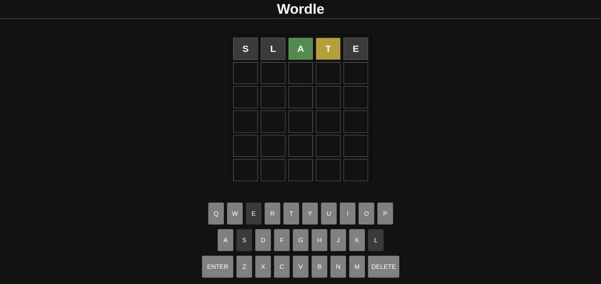

# React App of popular game Wordle

This Game is a clone of the game [Wordle](https://www.nytimes.com/games/wordle/index.html) using React and Yarn.

## Description

You are to guess a 5-letter word in 5 guesses. After every guess, each letter is marked as either green, yellow or gray: green indicates that letter is correct and in the correct position, yellow means it is in the answer but not in the right position, while gray indicates it is not in the answer at all.

## Getting Started

To use the App, follow these steps:

1. Clone the GitHub repository to your local machine:
   ```
   git clone https://github.com/Kritika30032002/ReactCreations.git
   ```
2. Navigate to the project directory:
   ```
   cd Wordle-Clone
   ```
3. Install the required dependencies using yarn:
   ```
   yarn install
   ```
4. Start the app by running:

   ```
   yarn start
   ```

   The app should now be up and running in your web browser. You can access it at `http://localhost:3000/`.

## Demo


