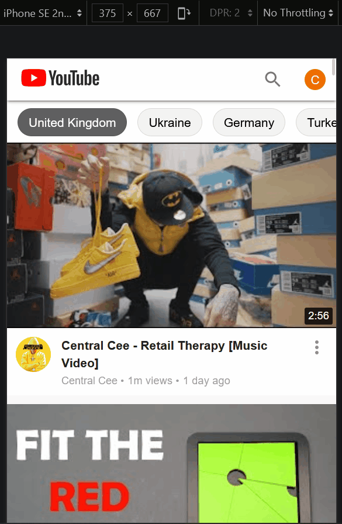

# React YouTube clone

## Demo of this app:


## Mobile view search function demo


## What does this app do?

- It is a clone of YouTube HomePage and SearchPage.
- HomePage displays the most popular videos of the selected country by querying data from the YouTube API.
- HomePage utilizes infinite-scroll feature, so new videos thumbnails will load when the user keeps scrolling down the page.
- Typing a word and clicking on search does a real search on YouTube API, 25 results are displayed on the SearchPage.

## What is this project about?

- This is mainly a material-ui and styled-components learning project. I aimed at making the website look as close to the original YouTube as possible.
- This project ends up turning into a state and complexity management exercise too because as the project progressed, I realized it is much bigger than I thought.

## Techstack?

- react.js (create-react-app)
- react-router
- axios
- styled-components
- Material-UI v4

## Setup Instructions

Install node requirements

```bash
npm i
```
Run the development server with 

```bash
npm start
```
You'll see output like this
```bash
Compiled successfully!

You can now view the app in the browser.

  Local:            http://localhost:3000
  On Your Network:  http://192.168.30.171:3000

Note that the development build is not optimized.
To create a production build, use npm run build.

webpack compiled successfully
```
