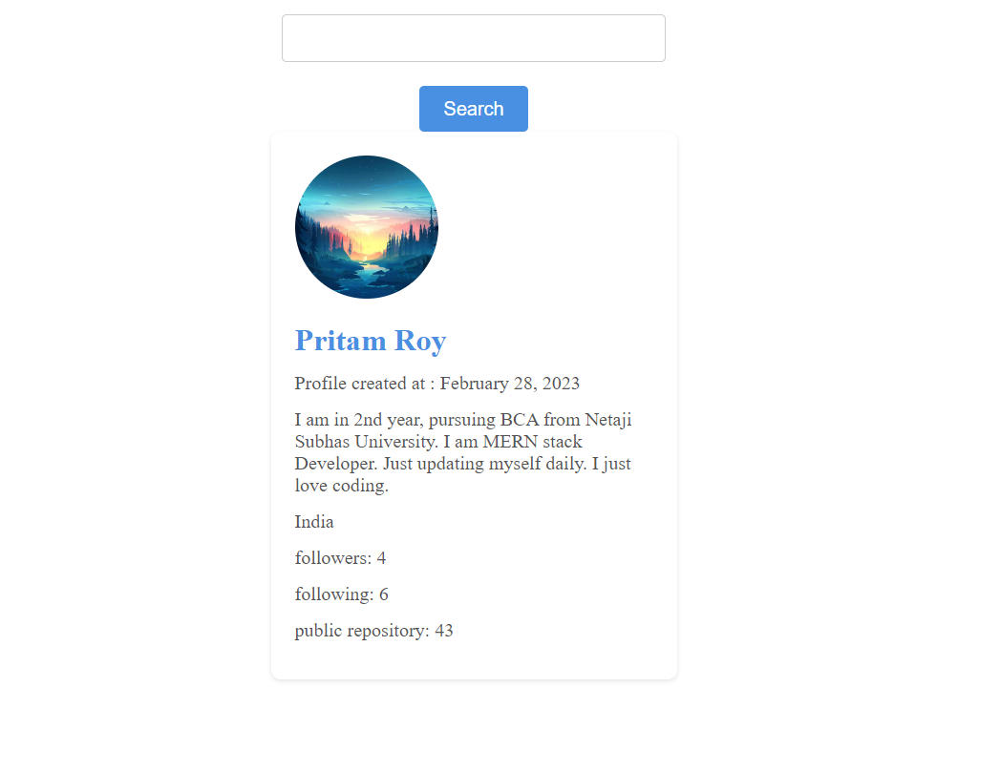

# Github user Finder

### THIS REACT APP WAS BUILD USING VITE

## STEPS TO Setup THE PROJECT Locally

1. First clone the repository using the command -

```
git clone https://github.com/Kritika30032002/ReactCreations.git
```

2. cd to project folder

```
cd github-profile-finder
```

3. Run "npm install".

```
npm install
```

4.Run "npm run dev" to run the app locally.

```
npm run dev
```

5. Open it in browser.

```
http://localhost:5173/
```


